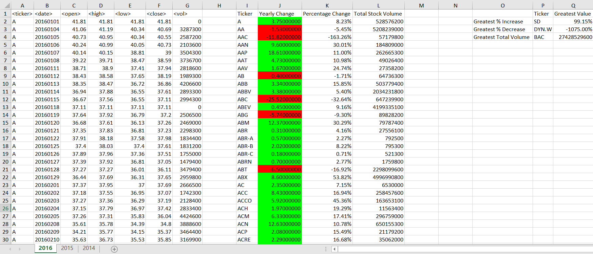

# VBA-challenge
By A. Rijpkema 10/16/2019

In this folder you'll find 2 directories.
One for the VBA Stock homework assignment
One for the VBA Challenge assignment

This VBA program runs from within Excel, collecting 2+ million stock data records (3 years worth on 3 sheets) and produces a short list per stock ticker with its yearly change, percentage change and total stock volume. A second iteration produces the top 3 tickers with the greatest increase, decrease and volume of that year. Some conditional formatting is addad (all using VBA) and voila:

Please see README's in [VBAStocks](VBAStocks/README_AR.md) and [VBAChallenge](VBAChallenge/README_AR.md) folders for details.

